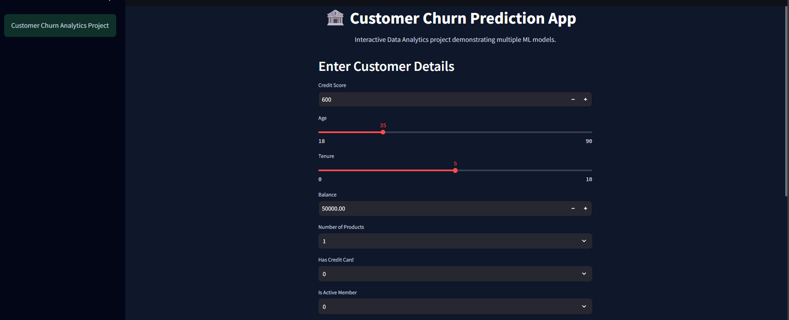
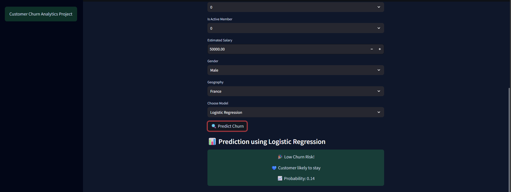
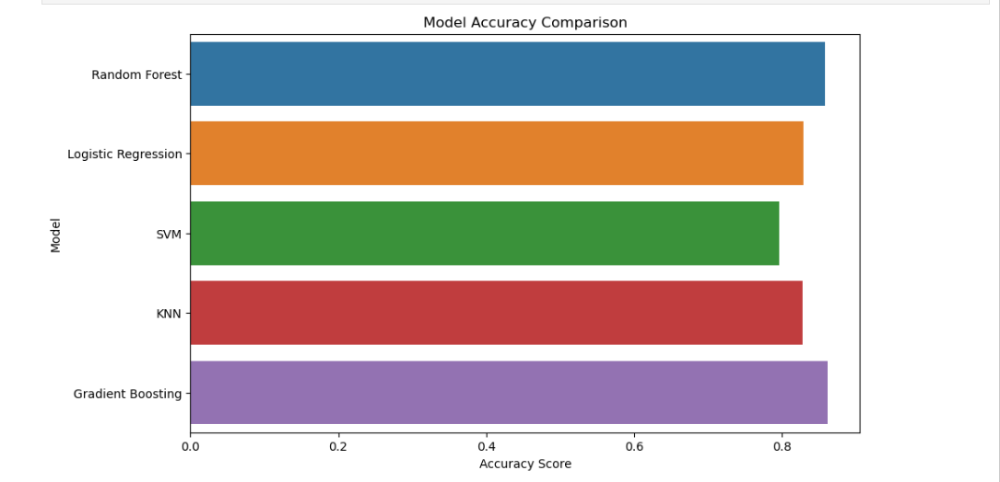
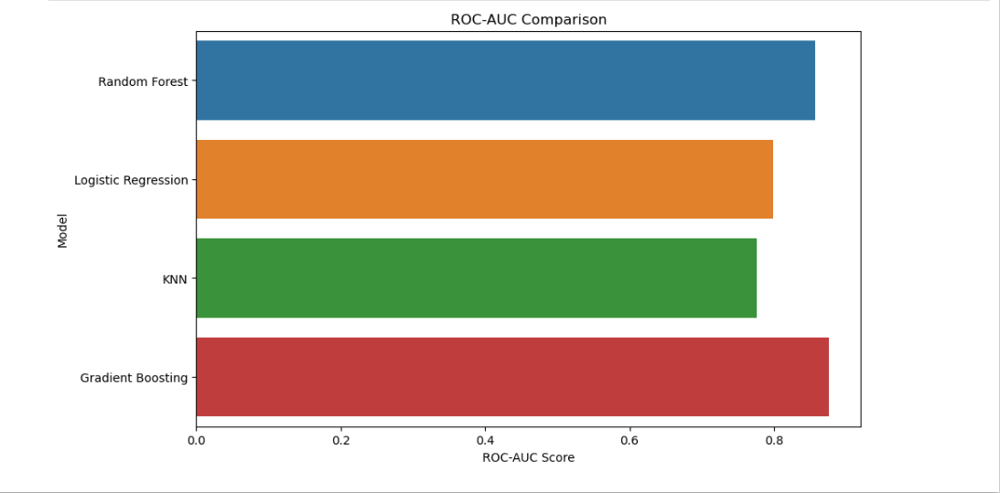

# 🏦 Customer Churn Analysis using Python (EDA & Machine Learning)

## 🎯 One-line Summary / Objective
A Python-based data analytics project focused on exploratory data analysis (EDA) and machine learning to analyze customer churn behavior and predict churn probability.

---

## 📌 Overview
This project analyzes banking customer data to understand patterns influencing customer churn and applies machine learning techniques to support predictive insights.

The goal is to demonstrate strong analytical thinking through data exploration, feature understanding, and model comparison, along with an interactive interface for prediction visualization.

---

## ❗ Problem Statement
Customer churn negatively impacts business revenue, especially in the banking sector where retaining customers is more cost-effective than acquiring new ones.

**Business Objectives**
- Identify customers likely to churn.
- Understand behavioral and demographic factors influencing churn.
- Build predictive models to estimate churn risk.
- Support data-driven customer retention strategies.

---

## 📊 Dataset Description
The dataset contains structured information about bank customers including demographic, financial, and engagement-related attributes.

**Key Features**
- Credit Score
- Geography
- Gender
- Age
- Tenure
- Account Balance
- Number of Products
- Credit Card Ownership
- Active Membership Status
- Estimated Salary
- Exited (Churn Indicator)

**Dataset Size**
- Approximately 10,000 customer records
- Structured tabular dataset suitable for analytical modeling.

---

## 🛠 Tools and Technologies

### Programming
- Python

### Data Analysis & Visualization
- Pandas
- NumPy
- Matplotlib
- Seaborn

### Machine Learning
- Scikit-learn

### Models Implemented
- Logistic Regression
- Random Forest
- Support Vector Machine (SVM)
- K-Nearest Neighbors (KNN)
- Gradient Boosting

### Development Tools
- VS Code
- Jupyter Notebook
- Git & GitHub
- Streamlit (for interactive demonstration)

---

### Data Cleaning & Preparation
- Checked missing values and duplicates.
- Encoded categorical variables:
  - Label Encoding for Gender
  - One-hot Encoding for Geography.
- Selected relevant analytical features.
- Applied feature scaling using StandardScaler.

---

### Exploratory Data Analysis (EDA)
EDA was the primary focus of this project.

Analysis included:
- Churn distribution visualization.
- Age-based churn comparison.
- Geography-wise churn analysis.
- Correlation heatmap for feature relationships.
- Outlier detection using boxplots.
- Feature relationship exploration.

**Key Observations**
- Older customers showed higher churn tendency.
- Active members were significantly less likely to churn.
- Customers with fewer products demonstrated higher churn risk.

---

### Machine Learning Modeling
Machine learning models were implemented to support analytical findings and compare predictive performance.

Models trained:
- Logistic Regression (baseline model)
- Random Forest
- Support Vector Machine
- KNN Classifier
- Gradient Boosting

---

### Model Evaluation
Models were evaluated using:
- Accuracy Score
- Confusion Matrix
- Classification Report
- ROC-AUC Score

Model comparison helped understand how different algorithms interpret structured customer data.

---

## 📈 Streamlit UI
An interactive Streamlit UI was developed to demonstrate predictions dynamically.

**Dashboard Features**
- Customer input-based churn prediction.
- Model selection and comparison.
- Real-time probability output.
- Clean blue-and-white themed user interface.

---

## ✅ Results & Conclusion

### Key Findings
- Customer engagement is a strong indicator of churn.
- Activity status plays a major role in retention.
- Ensemble models provided more stable predictions.

### Business Impact
Organizations can use predictive insights to:
- Identify high-risk customers early.
- Design personalized retention campaigns.
- Reduce revenue loss caused by churn.

---

## 🚀 Future Work
- Hyperparameter tuning for improved model performance.
- Explainable AI techniques for model interpretation.
- Cloud deployment for public access.
- Integration with real-time datasets.
- Expanded analytical dashboards.

---
